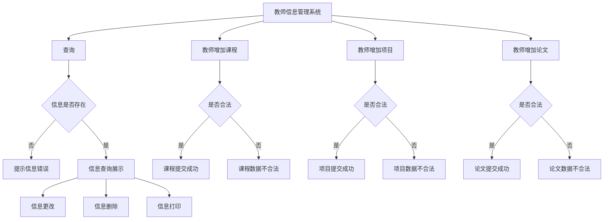

<center><font size = "5">Database  Lab3

<center>PPB21051012 刘祥辉

## 1、需求分析

### 1.1 系统目标

​	本系统目标是开发一个面向教师的教学科研登记系统

### 1.2需求说明

- 登记发表论文情况：提供教师论文发表信息的的增、删、改、查功能；输入时要求检查：一篇论文只能有一位通讯作   者，论文的作者排名不能有重复，论文的类型和级别只能在约定的取值集合中选取（实现时建议用下拉框）。

- 登记承担项目情况：提供教师承担项目信息的增、删、改、查功能；输入时要求检查：排名不能有重复，一个项目中所有教师的承担经费总额应等于项目的总经费，项目类型只能在约定的取值集合中选取。

- 登记主讲课程情况：提供教师主讲课程信息的增、删、改、查功能；输入时要求检查：一门课程所有教师的主讲学时总额应等于课程的总学时，学期。
-  查询统计：
  - 实现按教师工号和给定年份范围汇总查询该教师的教学科研情况的功能；例如输入工号“01234”，“2023-2023”可以查询 01234 教师在 2023 年度的教学科研工作情况。
  - 实现按教师工号和给定年份范围生成教学科研工作量统计表并导出文档的功能，导出文档格式可以是 PDF、Word、Excel 等。

## 2、总体设计

### 2.1系统模块结构

```
│  .flaskenv
│  app.py
│
├─static
│  │  favicon.ico
│  │  style.css
│  │
│  └─images
│          avatar.png
│          totoro.gif
│
├─templates    
│      404.html
│      add_course.html       #课程添加
│      add_paper.html		#论文添加
│      add_project.html		#项目添加
│      base.html
│      convert_pdf.html		#转换pdf			
│      edit_course.html		#课程修改
│      edit_paper.html		#论文修改
│      edit_project.html	#项目修改
│      index.html
│      search.html			#信息搜索
│     
│
└─__pycache__
        app.cpython-311.pyc  
```

### 2.2系统工作流程




### 2.3数据库设计

ER图：


最终的物理结构：


## 3.详细设计

### 3.1 实现配置

**开发环境**

```
MySQL Workbench 8.0 CE + VS Code
```

**数据库系统**

```
Ver 8.0.32 for Win64 on x86_64 (MySQL Community Server - GPL)
Copyright (c) 2000, 2023, Oracle and/or its affiliates.
```

**技术栈（Technology Stack）**

```
Bootstrap CSS renderer
Flask Framework (web)
javascript (js)
pymysql (python)
HTML language (html)
```

### 3.2 论文、课程、项目的增加模块

这里以课程为例，其他两项类似

效果图：


**流程**：前段将输入的信息发送给后端，后端通过定义的函数完成检测，若合法则提交更改：

```python
def add_paper():
    if request.method == 'POST':
        # 检查教师信息表单
        teacher_name = str(request.form['teacher_name'])
	  	#以POST方式接受内容，为了简化省略了其他项
        ...
        ...
        existing_teacher = Teacher.query.filter_by(teacher_id=teacher_id).first()
        existing_paper = Paper.query.filter_by(paper_title=paper_title).first()
        paper_id =  db.session.query(Paper.paper_index).filter(Paper.paper_title == 																	paper_title).scalar()
        paper_id = int(paper_id) if paper_id else -1

        existing_paper_teacher = PublishedPapers.query.filter(
            							PublishedPapers.teacher_id == teacher_id,
                                          PublishedPapers.paper_index == paper_id).first()
        
        res = info_paper_check(teacher_id,teacher_name,paper_rank,corresponding ,paper_id,
                                existing_teacher, existing_paper, existing_paper_teacher)   
        #info_paper_check(...)函数是用于检测输入是否合法，以满足需求
        if res:
            return redirect(url_for('add_paper'))
                    
		#若提交合法则将数据提交到数据库中
       	new_teacher = Teacher(
            teacher_name =  teacher_name,
            teacher_id  =   teacher_id,
            teacher_sex =   teacher_sex,
            teacher_jobTitle = teacher_jobTitle
        )
        ...
        ...
        db.session.commit()
        flash('科研信息添加成功！')

        return redirect(url_for('index'))
    return render_template('add_paper.html')
```

### 3.3 论文、课程、项目的编辑

同样以论文编辑为例：

点击Edit可以进入到相应的编辑页面：


**流程：**

选择需要更改的信息，在方框中填写需要变更的信息，随后将信息传入后端：

```python
@app.route('/edit_paper/<string:ID>/<int:index>', methods=['GET','POST'])
def edit_paper(ID, index):
    paper_teacher = PublishedPapers.query.get_or_404((str(ID),int(index)))
    paper = Paper.query.get_or_404(int(index))
    resume = search_person(ID)
    old_info = {
        'teacher_id': paper_teacher.teacher_id,
		...
        ....
    }

    if request.method == 'POST':
        paper_title = str(request.form['paper_title'])
		...
        ...

        paper_records = PublishedPapers.query.filter(PublishedPapers.paper_index == index, PublishedPapers.teacher_id != ID).all()
        paper_ranks = [record.paper_rank for record in paper_records]
        corresponding_values = [record.corresponding for record in paper_records]
		#更改信息检测，排名不能重复，通讯作者只能有一名
        if paper_rank in paper_ranks :
            flash('Paper ranking already exists.')
            return redirect( url_for('edit_paper' , ID = ID, index = index ) )
        
        if corresponding==1 and 1 in corresponding_values:
            flash('A paper can only have one corresponding author.')
            return redirect( url_for('edit_paper' , ID = ID, index = index ) )
        
        # 更新论文信息
        paper.paper_title = paper_title
		...
        ...
        # 提交更新到数据库
        db.session.commit()
        flash('Information changed successfully!')
        return redirect( url_for('edit_paper' , ID = ID, index = index ) )
        # return redirect(url_for('index'))
    
    return render_template('edit_paper.html', paper_info = old_info)
```

课程、项目信息的修改类似，不再累赘重复

### 3.4 查询统计模块


**输入：**

- **Teacher_ID**：教师工号
- **Name**:教师姓名
- **Year**：查询起止年份

**流程：**

提交信息后通过`search()`函数将信息发送给前段：

```python
@app.route('/search/<teacher_id>/<teacher_name>/<year>')
def search(teacher_id, year, teacher_name):

    resume_dict = search_person(teacher_id)
    if not resume_dict:
        flash("There is no record of this teacher")
        return redirect(url_for('index'))
    if resume_dict['name'] != teacher_name:
        flash("ID and name do not match")
        return redirect(url_for('index'))
    papers_dict = search_paper(teacher_id, year)
    courses_dict = search_course(teacher_id, year)
    projects_dict = search_project(teacher_id, year)

    return render_template('search.html', year = year ,
                                          resume_dict=resume_dict, papers_dict=papers_dict, 
                                          courses_dict=courses_dict, projects_dict=projects_dict)
```

`search_paper()`函数将搜索返还与教师关联的论文信息，具体实现如下:

```python
def search_paper(teacher_id, year_range):
    start_year, end_year = map(int, year_range.split('-'))

    # 查询教师在指定年份范围内发表的论文
    filtered_papers = db.session.query(Paper.paper_title, Paper.paper_year, Paper.paper_type, Paper.paper_class, Paper.paper_source,
                                       PublishedPapers.paper_rank,PublishedPapers.corresponding, Paper.paper_index).\
                        join(PublishedPapers, Paper.paper_index == PublishedPapers.paper_index).\
                        join(Teacher, Teacher.teacher_id == PublishedPapers.teacher_id).\
                        filter(Teacher.teacher_id == teacher_id).\
                        filter(Paper.paper_year >= str(int(start_year)) + '-01-01').\
                        filter(Paper.paper_year < str(int(end_year) + 1) + '-01-01').\
                        distinct().\
                        all()
    papers_dict = []
    for paper in filtered_papers:
        paper_dict = {
            'paper_title': paper[0],
            'paper_year': paper[1],
            'paper_type': PAPER_TYPE_CHOICES.get(paper[2]),
            'paper_class': PAPER_LEVEL_CHOICES.get(paper[3]),
            'paper_source': paper[4], 
            'paper_rank': f"排名第{paper[5]}",
            'paper_corresponding': paper[6] ,
            'paper_index': paper[7]
        }
        papers_dict.append(paper_dict)
    return papers_dict
```

`search_course()`和`search_project()`类似，不再重述

### 3.5 删除模块


点击Delete即可删除相关信息

后端实现如下:

```python
@app.route('/delete_paper/<string:ID>/<int:index>', methods=['GET','POST'])
def delete_paper(ID, index):
    paper_teacher = PublishedPapers.query.get_or_404((str(ID),int(index)))
    try:
        # 删除记录
        db.session.delete(paper_teacher)
        # 提交更改
        db.session.commit()
        flash('The paper information has been successfully deleted!')
    except Exception as e:
        db.session.rollback()
        flash(f'Error deleting paper information: {str(e)}')

    num_paper = db.session.query(db.func.count(PublishedPapers.paper_index)).filter(PublishedPapers.paper_index == int(index)).scalar()
    if not num_paper:
        paper = Paper.query.get_or_404(int(index))
        try:
            db.session.delete(paper)
            db.session.commit()

        except Exception as e:
            db.session.rollback()
            flash(f'Error deleting paper information: {str(e)}')

    return redirect(url_for('index'))
```

先尝试删除`paper_teacher`表中相关信息，若`paper`表中某篇论文没有存在于`papper_teacher`表中，便将该paper从`paper`表中删除。对于项目、课程的删除类似。

### 3.6 pdf打印信息

本次实验使用`pdfkit`完成教师信息转换为pdf文件：

```python
@app.route('/generate_pdf/<teacher_id>/<year>')
def generate_pdf(teacher_id, year):
    try:
        resume_dict = search_person(teacher_id)
        papers_dict = search_paper(teacher_id, year)
        courses_dict = search_course(teacher_id, year)
        projects_dict = search_project(teacher_id, year)
        start_year, end_year = map(int, year.split('-'))

        rendered_html = render_template('convert_pdf.html', start_year=start_year, end_year=end_year,
                                        resume_dict=resume_dict,
                                        papers_dict=papers_dict,
                                        courses_dict=courses_dict,
                                        projects_dict=projects_dict)

        options = {
            'enable-local-file-access': None,
            'no-stop-slow-scripts': None
        }
        
        pdf = pdfkit.from_string(rendered_html, False, configuration=config, options=options)
        
        response = make_response(pdf)
        response.headers['Content-Type'] = 'application/pdf'
        response.headers['Content-Disposition'] = 'attachment; filename=report.pdf'

        return response
    except IOError as e:
        app.logger.error('Error generating PDF: %s', e)
        return jsonify({'error': 'Error generating PDF', 'message': str(e)}), 500
```

## 

## 4.实现与测试

使用方法：

命令行输入`flask run`

### 4.1实现结果

#### 主界面：


#### 信息插入：


#### 信息编辑：


#### 信息删除：

这里为点击delete后的是否删除确认


#### 信息打印：

转化好的信息打印表


### 4.2测试结果

测试了几个信息插入：


### 4.3 实现中的难点

实验总体开发并不难，只要有了思路按部就班就可以写完。最麻烦的地方是如何从零开始写前后端，所幸python中Flask库非常方便减少了我许多的麻烦，并且html语言于是非常容易上手。所以只要肯稍微花一些时间用于实验，其实是不难完成的。

## 5总结与讨论

- **全局统筹规划**

  在完成系统的步骤中，需要先做一个整体的设计，若是边做边想未来怎么做肯定会出现许多漏洞。本次我的paper表中的主键我先设置为auto increase，后面便出现了许多问题，如果一开始便设置为自定义便不会有那么多麻烦。

- **开发工具的选择**

  本次我选用Flask完成后端，感觉非常方便，加上python丰富的库函数，大大加快了开发速度。若选用其它工具可能达不到事倍功半的效果。